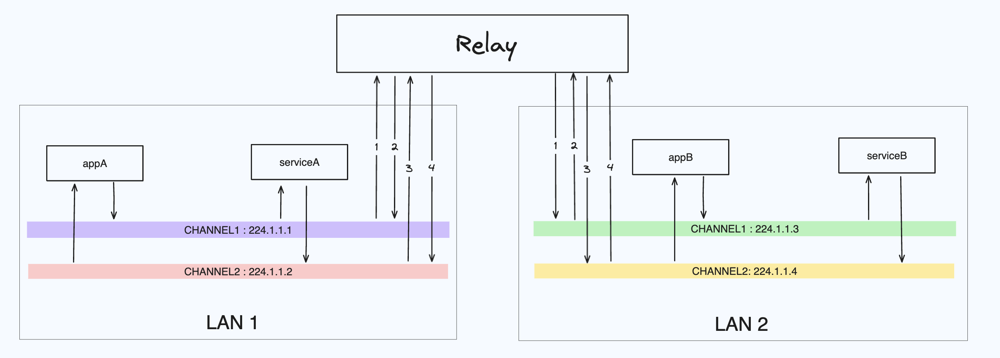

# Assignment 2

## Authors
- Denis Aleksandrov
- Sebastian Castro Obando

## Description

From a high level, we built the relay by connecting each channel of each LAN to their corresponding channel in the other LAN. In our case, we had 2 channels in each LAN, which meant we needed 4 *relay connections* as illustrated below.


In addition to creating makefiles, we wrote shell scripts to compile and run the code. All the outputs of the runs are sent to log directories corresponding to the tests. But, there are multiple ways to run our code.

Firstly, if you wish to run all the test cases with one command, you may execute the script `./run.sh` which will run both the `lan-isolation` and `lan-relay` tests in the background. All the interactions between the apps and sevices in both isolation and relay cases will be logged in `isolation_logs` and `relay_logs` directories respectively in the current directory. 
```bash
./run.sh
```

Secondly, if you wish to run the tests separetely, you may go to the test directory (i.e. `lan-isolation` and `lan-relay`) and run the shell script starting the keyword `demo` (i.e. `demo-part1.sh` and `demo-part2.sh`). For example,

```bash
cd lan-isolation
./demo-part1.sh
# wait until demo finishes...
cd ./logs/
# analyse the logs
```
or 
```bash
cd lan-relay
./demo-part2.sh
# wait until demo finishes...
cd ./logs/
# analyse the logs
```

Finally, if you wish to run the tests manually, you may compile the code and run the executables as you see fit. To do so, go to the testing directories and run the makefile. For example,
```bash
cd lan-isolation
make
# then run apps or services as you see fit
```
or
```bash
cd lan-relay
make
# then run apps or services as you see fit
```

*We did not use Docker, because in the assignment description we read : "Get LAN-A and LAN-B running on the same machine or Docker containers".*

### Test setup
On LAN-A, we created the following apps and services:
- `LAN-A_app1` : Listens to ads from `LAN-A_service1`
- `LAN-A_app2` : Listens to ads from `LAN-A_service2`
- `LAN-A_service1`
- `LAN-A_service2`

On LAN-B, we created the following apps and services:
- `LAN-B_app1` : Listens to ads from `LAN-B_service1`
- `LAN-B_app2` : Listens to ads from `LAN-B_service2`
- `LAN-B_service1`
- `LAN-B_service2`

## Part 1 : LAN isolation
### Test setup
To show LAN isolation, we created two apps and two services in two different LANs. On LAN-A, apps and services are using the multicast addresses `224.1.1.1` and `224.1.1.2`. On LAN-B, apps and services are using the multicast addresses `224.1.1.3` and `224.1.1.4`. 

Test files are located in ./lan-isolation/test_files/

### What is expected?
- app# listens to ads from service# in each respective LAN
- Within the LAN apps will receive heartbeats and notifications from services and services will receive discoveries from apps
- No LAN-A heartbeats/notifications/ads/discoveries will be in LAN-B and vice versa

## Part 2 : LAN Relay
### Test Setup
To show LAN relay, we used the previously created apps and services in LAN-A and LAN-B. We moved some of them in the other LAN, and we created a relay to connect the two LANs.

Test files are located in ./lan-relay/test_files/

### What is expected? 
- app# listens to ads from service# in each respective LAN
- Within each LAN apps will receive heartbeats and notifications from services and services will receive discoveries from apps
    - This information will flow between LAN-A and LAN-B freely

## Questions 
1. **Question:** Suppose you are asked to extend the relay to work with more than 2 LANs, what is the major issue to be solved? <br> **Answer:** Our implementation of the relay works by connecting the multicast channels of each LAN to their counter part on the other LAN. For example, if an app sends a discovery in channel1 of LAN-A, then the relay will forward this message to the channel1 of LAN-B. And vice versa for an app in LAN-B. As you may notice, the relay needs to have a receiver and a sender for each channel in each LAN it connects. For this assignment, we were asked to connect 2 LANs, so we needed 8 multicast objects (4 senders and 4 receivers). 


(from Denis: I don't think that the memory is much of an issue tbh) and is not scalable. 
(From seb: I think you are right, memory should not be an issue.)


2. **Question:** How would you improve your design? <br> **Answer:** As we outline in the previous question, we are essentially relying in creating 2 multicast objects for each channel. The very first improvement of our design would need to be to find a way to connect the LANs without this object creation.
(Denis) I think that we could just chain relays. Keep a reference of the LANS that are already relayed. If we want to connect another LAN, take the last relayed LAN from the reference table, and relay_init with its meta-data and the new LAN. Our implementation would need a little tweaking, but the logic would stay the same.

## Contribution Disclosure
Each author has contributed equally to this assignment.
